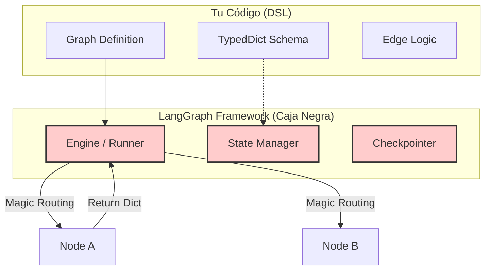
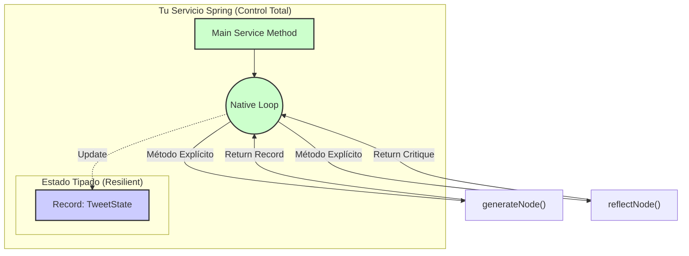

# Spring AI Reflection Agent (Writer/Critic)

Este proyecto demuestra cómo implementar un **Agente de Reflexión** (patrón Writer-Critic) utilizando **Java 21** y **Spring AI 2.0**. 

El objetivo es mostrar cómo un patrón complejo, comúnmente asociado a frameworks de Python como **LangGraph**, puede implementarse de forma **más sencilla, sostenible y robusta** utilizando el ecosistema estándar de Java.

> **Caso de Uso:** Generador de Tweets Virales. El agente escribe un borrador, un crítico lo evalúa y sugiere mejoras, y el escritor regenera el tweet.

## 🆚 Java (Spring AI) vs LangGraph (Python)

A menudo se cree que para orquestar agentes se necesita un framework de grafos complejo. Este proyecto demuestra lo contrario:

| Característica | Enfoque LangGraph (Python) | Enfoque Spring AI (Java) | Ventaja Java |
| :--- | :--- | :--- | :--- |
| **Definición del Grafo** | DSL específico (`StateGraph`, `add_node`, `add_edge`). | **Código Java Estándar**. Métodos y bucles (`while`, `if`). | Curva de aprendizaje cero. Si sabes Java, sabes orquestar. |
| **Estado (State)** | Diccionario (`TypedDict`) pasado implícitamente. | **Clases/Records Tipados**. Argumentos de método explícitos. | Refactoring seguro y autocompletado del IDE. |
| **Memoria** | Gestión de `checkpoint` compleja. | **`MessageChatMemoryAdvisor`**. Inyección transparente. | Gestión automática del historial sin código boilerplate. |
| **Observabilidad** | Requiere SaaS externo (LangSmith) para ver trazas. | **Logs Estándar** (`SLF4J`). Trazabilidad nativa. | Se integra con tus herramientas actuales (Datadog, ELK, Console). |
| **Mantenibilidad** | Frágil en refactorings grandes por tipado dinámico. | **Compile-time safety**. El compilador te avisa si rompes el flujo. | Sostenible a largo plazo en equipos grandes. |

### 📊 Comparación Visual de Arquitectura

#### 1. Complejidad Cognitiva de LangGraph
En frameworks basados en grafos, gran parte de la lógica (y el control de flujo) está oculta dentro del motor del framework ("The Engine"). El desarrollador define *configuraciones* (DSL), no flujos explícitos.



#### 2. Simplicidad Explícita de Java (Spring AI)
En este enfoque, **el código ES el grafo**. El flujo es visible, depurable y sigue las reglas estándar de programación que ya conoces. La resiliencia proviene de la JVM y el tipado fuerte de los Records.



### ¿Por qué "Más Sencillo"?
En lugar de aprender una librería de grafos, usamos **"Code as Orchestration"**. 
*   Un **Nodo** es simplemente un método Java (`generateNode(...)`).
*   Una **Arista (Edge)** es simplemente una llamada a otro método o una condición `if`.
*   El **Estado** son variables locales o campos de clase.

## 🏗️ Arquitectura del Agente

La lógica reside en `ReflectionAgentService.java`:

1.  **Nodo Generador (`generateNode`)**: Usa `gpt-4o-mini` para crear contenido creativo.
2.  **Nodo Crítico (`reflectNode`)**: Asume un rol (persona) para criticar constructivamente el contenido.
3.  **Bucle de Control**: Un bucle `for` simple orquesta las iteraciones hasta que se alcanza un límite o satisfacción (simplificado aquí a 3 iteraciones).

```java
// Pseudocódigo de la orquestación (sin frameworks de grafos)
for (int i = 0; i < maxIterations; i++) {
    // 1. Writer genera
    String content = generateNode(currentContent, critique);
    
    // 2. Critic evalúa
    critique = reflectNode(content);
    
    // 3. Loop continua con el nuevo contexto (Managed Memory)
}
```

## 🚀 Ejecución

### Requisitos
*   Java 21
*   Maven (o `./mvnw` incluido)
*   API Key de OpenAI (o compatible).

### 1. Configuración
Edita `src/main/resources/application.properties` o exporta tu variable:

```bash
export SPRING_AI_OPENAI_API_KEY=sk-tu-api-key-aqui
```

### 2. Ejecutar
```bash
./mvnw spring-boot:run
```

### 3. Probar
Abre otra terminal y lanza una petición:

```bash
curl "http://localhost:8080/ai/tweets/generate?topic=SpringAI"
```

Verás en los logs de la aplicación cómo el agente "piensa":

```text
INFO: Starting Node: generate
INFO: Iteration 1: [Borrador inicial...]
INFO: Entering Node: reflect
INFO: Critique: [Crítica del borrador...]
INFO: Entering Node: generate
INFO: Iteration 2: [Versión mejorada...]
```

## 🛠️ Stack Tecnológico

*   **Spring Boot 4.0.1**: Base sólida y moderna.
*   **Spring AI 2.0.0-M1**: 
    *   `ChatClient`: API fluida.
    *   `MessageWindowChatMemory`: Gestión de ventana de contexto eficiente.
    *   `Structured Output`: (Opcional) Para forzar respuestas JSON estrictas.

---
*Este proyecto demuestra que la complejidad accidental de los frameworks de agentes a menudo no es necesaria. Con abstracciones sólidas (Spring AI) y un lenguaje robusto (Java), la orquestación es simplemente... programación.*
